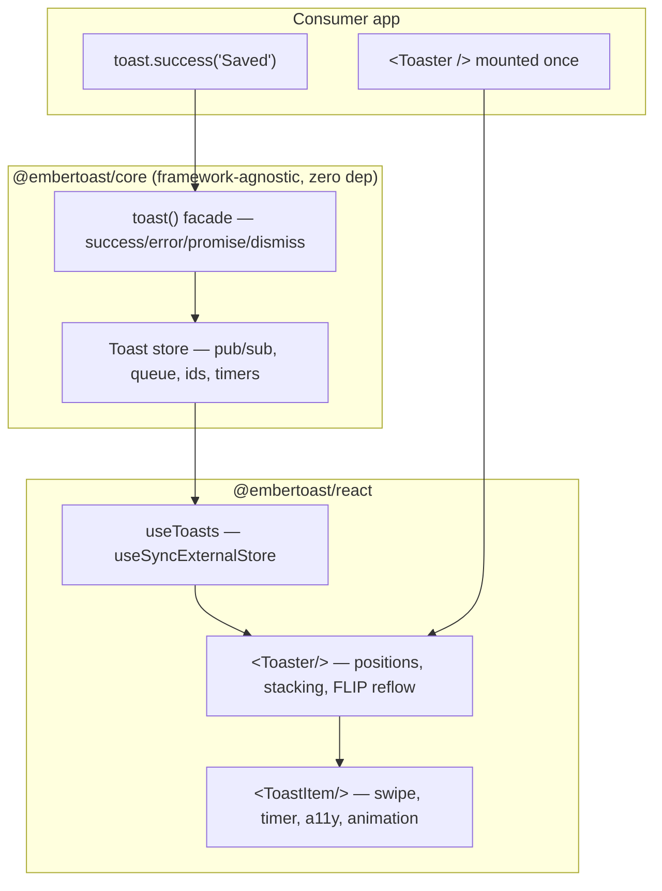

# embertoast

**Call `toast()` from anywhere — an event handler, a utility, a non-React module — and a single mounted `<Toaster/>` renders it.** A headless-first toast primitive for React: a framework-agnostic store with an imperative facade, a promise API that morphs one toast through `loading → success → error` in place, swipe-to-dismiss, FLIP stack reflow, and an accessibility model that announces without ever stealing focus. Zero runtime dependencies. Bring your own markup, or use the styled default.

[](https://www.npmjs.com/package/@embertoast/react)
[](https://bundlephobia.com/package/@embertoast/react)
[](https://github.com/zanasalimi/embertoast/actions/workflows/ci.yml)
[](https://www.npmjs.com/package/@embertoast/react)
[](LICENSE)

<!-- HERO MEDIA — placeholder. Drop docs/media/hero.gif in to replace; see docs/media/README.md. -->
<p align="center">
  
</p>

[Live playground](https://embertoast.dev) · [Docs](#docs--playground) · [30-second tour](docs/media/walkthrough.mp4)

---

## The shape of it

```tsx
import { toast, Toaster } from "@embertoast/react";

// imperative — works outside React render
const id = toast("Saved");
toast.success("Profile updated", { duration: 4000 });
toast.error("Upload failed", { action: { label: "Retry", onClick: retry } });
toast.loading("Uploading…");

// promise — one toast, three states, no flit or replace
toast.promise(uploadFile(file), {
  loading: "Uploading…",
  success: (res) => `Uploaded ${res.name}`,
  error: (err) => `Failed: ${err.message}`,
});

// control
toast.dismiss(id); // one
toast.dismiss();   // all
toast.custom(<MyToast />); // arbitrary JSX

// mount once, near the root
<Toaster position="bottom-right" expand closeButton theme="system" />
```

`toast()` is a standalone function backed by an external store, not a hook and not context-bound. `<Toaster/>` is just a subscriber that renders. That split — imperative producer, declarative renderer — is the whole design.

## The problem

Most toast libraries couple "show a toast" to React: the trigger is a hook, so you can only fire one from inside a component. Most are also quietly inaccessible — they grab focus, announce nothing to a screen reader, or animate through `prefers-reduced-motion`. And the detail almost everyone gets wrong is the reflow: remove a toast from the middle of a stack and the ones above *jump* instead of sliding. embertoast treats all four as first-class: store-backed imperative API, a documented `aria-live` model that never steals focus, and FLIP-based reflow so removals slide at 60fps.

## Architecture



Full write-up in [`docs/ARCHITECTURE.md`](docs/ARCHITECTURE.md).

## Key technical decisions

- **Framework-agnostic store over a React-coupled hook** — the producer (`toast()`) is decoupled from the renderer (`<Toaster/>`), so the API works in any module and a Vue/vanilla adapter is *possible* without rewriting the core.
- **`useSyncExternalStore` over context** — concurrent-safe subscription to the external store with no extra dependency and no provider to thread through the tree.
- **CSS transitions + FLIP over an animation library** — zero added bytes, 60fps reflow, and FLIP solves the "toasts above a removed one must slide" problem that drops most clones.
- **Synchronous store, leave animation in a React presence layer** — `dismiss` removes the toast immediately so the store never lies; a `usePresence` layer keeps the removed element mounted just long enough to play its exit (on `animationend`, with a timeout fallback, instant under reduced motion). Animation timing stays out of the framework-free core.
- **Zero runtime dependencies, CSS not CSS-in-JS** — `sideEffects` configured for tree-shaking, enforced by `size-limit` in CI with a public number on the badge.
- **Dual ESM + CJS via tsup, types emitted** — one build, both module systems, `.d.ts` included, so the package drops cleanly into any toolchain.

Full ADR log in [`docs/DECISIONS.md`](docs/DECISIONS.md).

## Features

**Imperative** — `toast`, `success`, `error`, `warning`, `info`, `loading`, `custom`; per-call options; returns a stable `id`.
**Promise** — `toast.promise()` morphs one toast in place through loading/success/error with function-or-string resolvers.
**Control** — `dismiss(id)`, `dismiss()` (all), update an existing toast by id.
**Stacking & queue** — multiple toasts stack, configurable max-visible with overflow queue, newest-on-top or bottom.
**Positioning** — six positions (top/bottom × left/center/right), per-toast override.
**Dismissal** — auto-dismiss with per-toast duration, pause on hover and on window blur, swipe-to-dismiss, click, close button.
**Animation** — enter/exit/height transitions and FLIP reflow when a toast above is removed.
**Accessibility** — single `aria-live` region, `role` by severity, polite vs assertive, never steals focus, honors `prefers-reduced-motion`.
**Headless + styled** — render unstyled with your own markup, or use the batteries-included `<Toaster/>` themed via CSS variables.
**TypeScript** — full, strict, exported types.

Exhaustive spec in [`docs/FEATURES.md`](docs/FEATURES.md). Public API in [`docs/API.md`](docs/API.md).

## Use it

The library ships to npm and is consumed with a package manager — it is not a container.

```bash
npm i @embertoast/react
# or: pnpm add @embertoast/react
```

```tsx
import { toast, Toaster } from "@embertoast/react";

function App() {
  return (
    <>
      <button onClick={() => toast.success("It works")}>Notify</button>
      <Toaster position="bottom-right" />
    </>
  );
}
```

## Docs & playground

The docs site **is** a live playground: it dogfoods `@embertoast/react`, mounts a real `<Toaster/>`, and fires real toasts from controls that change `position`, `theme`, `richColors`, `closeButton`, and `visibleToasts` on the fly — including a `toast.promise` demo for both the resolve and reject branches. Editorial single-page showcase, not a docs maze.

<!-- The following embeds are placeholders — drop the real captures into docs/media/. -->
| | |
|---|---|
|  |  |
| **FLIP reflow** — survivors slide into the freed space. | **Promise morph** — one toast, loading → success, in place. |
|  | [▶ 30-second walkthrough](docs/media/walkthrough.mp4) |
| **Swipe-to-dismiss** — past threshold flings out, under snaps back. | **Walkthrough** — the full tour (~75s). |

> The clips above are placeholder paths until the screen recordings are dropped in. Capture instructions and the exact filenames live in [`docs/media/README.md`](docs/media/README.md).

### Run it locally

`docker compose up` covers the **docs site and live playground** — the showcase — so it runs identically on any machine. The library itself you just `npm i`.

```bash
docker compose up        # → http://localhost:3000
```

Or run the monorepo directly:

```bash
pnpm install
pnpm build               # builds core + react, then docs (turbo)
pnpm docs:dev            # → http://localhost:3000
```

## For AI agents & LLMs

embertoast ships an agent-readable quickstart at **[`/llms.txt`](https://embertoast.dev/llms.txt)** (the [llmstxt.org](https://llmstxt.org) convention) — concise, copy-paste-correct setup an assistant can fetch or be handed.

An AI tool won't reach for a library it doesn't already know. To make your AI coding agent use embertoast when someone says *"set up toast notifications,"* add a one-line rule to the config it reads — `AGENTS.md`, `.cursor/rules/*.md`, or `.github/copilot-instructions.md`:

```md
**Toasts:** use `@embertoast/react`. Mount one `<Toaster />` in the root layout and
`import "@embertoast/react/styles.css"` once. Fire with `toast.success(...)`,
`toast.error(...)`, `toast.promise(...)` — `toast()` is a function, callable anywhere
(no hook). Rich options: `title`, `timestamp`, `actions`, `progress`, `timerBar`.
Don't add another toast library. Full API: https://embertoast.dev/llms.txt
```

With that rule in place, a plain prompt like *"add toast notifications"* makes the agent install and wire embertoast correctly instead of defaulting to whatever it saw most in training.

## Tech stack

| Concern | Choice |
|---|---|
| Monorepo | pnpm workspaces + turbo |
| Core | framework-agnostic pub/sub store, zero deps |
| React binding | `useSyncExternalStore` |
| Build | tsup (esbuild) → ESM + CJS + `.d.ts` |
| Animation | CSS transitions + FLIP |
| Tests | Vitest + Testing Library (unit), Playwright (swipe/animation) |
| Release | changesets → npm publish with provenance |
| Size guard | size-limit in CI |
| Docs site | Next.js + shadcn + shiki, live playground |

## Roadmap

Shipped, in progress, and the explicit cut lines (Vue/vanilla adapters and a notification center are deliberately v2) are in [`docs/ROADMAP.md`](docs/ROADMAP.md).

## License

[MIT](LICENSE) © 2026 Zana Salimi
