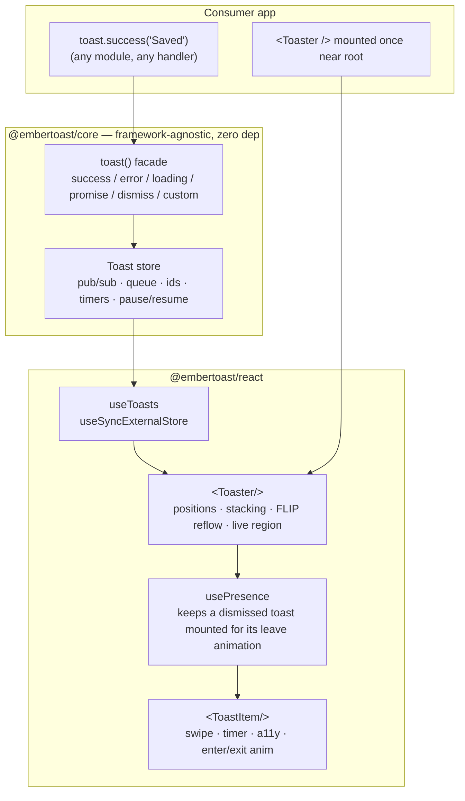
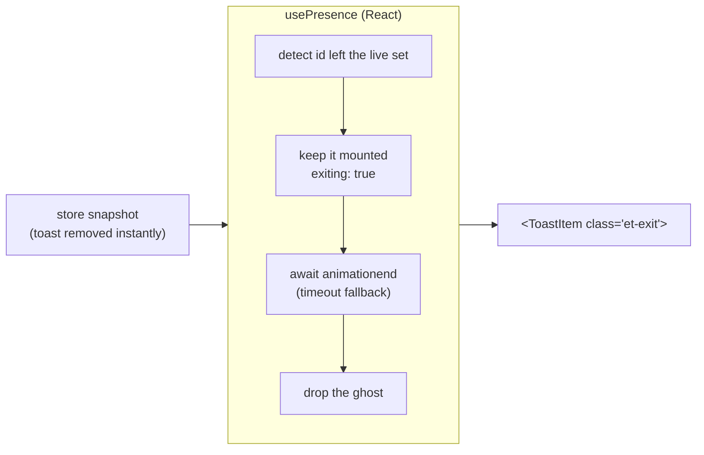
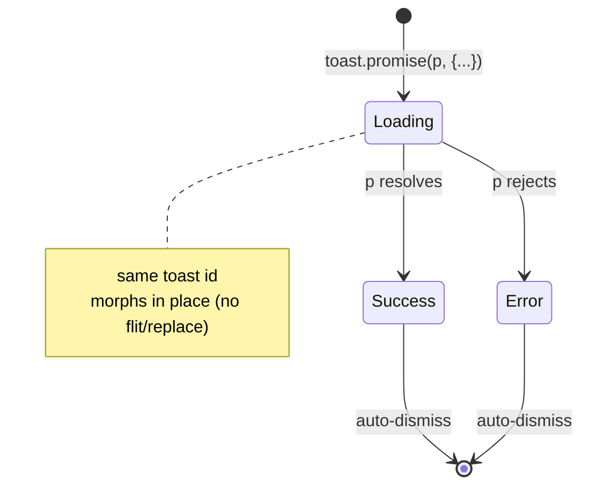

# Architecture

embertoast splits a notification system into two halves that most libraries fuse: a **producer** (`toast()`, an imperative function) and a **renderer** (`<Toaster/>`, a declarative component). They communicate only through a small framework-agnostic store. Everything below follows from that one decision.

## System context

## Why `toast()` is a store, not a hook

A hook can only run inside a React component during render. That forces every "show a toast" call to originate from a component and to thread context or a ref to reach the renderer. It also rules out firing a toast from a plain utility, an Axios interceptor, a websocket handler, or any non-React module.

embertoast inverts this. The store is a module-level singleton that exists independent of React. `toast()` is a closure over that store — calling it mutates state and notifies subscribers. `<Toaster/>` is *only* a subscriber: it reads the store via `useSyncExternalStore` and renders whatever is there. The producer never imports React; the renderer never owns state.

Consequences:

- **Call from anywhere.** `toast()` works outside render, outside components, outside React entirely.
- **One renderer, many producers.** Any number of modules can fire toasts; a single mounted `<Toaster/>` shows them.
- **Adapters are possible.** Because the store carries no React, a Vue/Svelte/vanilla renderer is a new subscriber, not a rewrite. (We ship React only — see ROADMAP cut lines.)
- **Concurrent-safe.** `useSyncExternalStore` is the React-blessed way to subscribe to an external store without tearing under concurrent rendering.

## Module breakdown

| Module | Package | Responsibility |
|---|---|---|
| `store.ts` | core | The pub/sub: id allocation, per-toast timers with elapsed tracking, pause/resume, and a **synchronous** add/update/dismiss. `dismiss` removes the toast from the snapshot immediately — there is no `exiting` flag and no deferred `remove` in the store; the store is a clean source of truth. The only stateful thing. |
| `toast.ts` | core | The `toast()` facade and its methods. Thin — it translates a call into a `store.add/update/dismiss`. `promise()` is the one method with real logic (lifecycle orchestration). |
| `types.ts` | core | The public type surface. `ToastOptions`, `Toast`, `Position`, `ToastType`, `PromiseMessages`, the `ToastStoreApi` contract. |
| `use-toasts.ts` | react | `useSyncExternalStore(subscribe, getSnapshot, getServerSnapshot)`. The whole React↔store bridge in one hook. |
| `use-presence.ts` | react | The leave-animation **presence layer**. The store drops a toast synchronously; this hook keeps a just-removed toast mounted briefly (`exiting: true`) so it can play its exit animation, then retires it. Removal is driven by an `animationend` event with a timeout fallback, and is instant under `prefers-reduced-motion`. This is where "exiting" lives — in React, not the store. |
| `Toaster.tsx` | react | The single subscriber. Owns the positioned container, the `aria-live` region, config push, and FLIP reflow across the list. Wraps the live snapshot in `usePresence` so a dismissed toast animates out instead of being hard-cut. |
| `ToastItem.tsx` | react | One toast: its countdown, pointer-drag swipe, accessible role, and — when the presence layer marks it `exiting` — the `et-exit` class plus the `animationend` report that retires it. |
| `styles.css` | react | The styled default, entirely CSS custom properties. Opt-in; headless users skip it. |

## How a toast moves through the system

1. Code calls `toast.success("Saved", opts)`.
2. The facade calls `store.add({ message, type: "success", ...opts })`. The store allocates an id, resolves options against per-type defaults, arms the auto-dismiss timer, and emits a new array reference.
3. Every subscriber's listener fires. `useToasts` triggers a re-render of `<Toaster/>`.
4. `<Toaster/>` trims each position group to `visibleToasts`, then runs that visible set through `usePresence`. A new item mounts; CSS plays the enter animation. The live region announces it (politeness by severity).
5. `<ToastItem/>` wires pause-on-hover/focus: hover, focus, or window blur calls `store.pause(id)`, which captures `remaining`; leaving calls `store.resume(id)`, which restarts from the remainder.
6. On expiry, swipe past threshold, click, or `toast.dismiss(id)`, the store removes the toast **synchronously** and emits — the snapshot no longer contains it. The store carries no "exiting" state. The React **presence layer** (`usePresence`) notices the id left the live set and keeps that toast mounted with `exiting: true` for one play of the leave animation; `<ToastItem/>` applies the `et-exit` class and reports `animationend` (a timeout fallback retires it if the event never fires). Meanwhile **FLIP** moves the survivors so they slide into the freed space instead of jumping. Under `prefers-reduced-motion` there is no exit phase — removal is instant. A queued (overflow) toast, if any, promotes into view on the next emit.

## Why the store removes synchronously and the leave animation lives in React

A toast's exit is a *rendering* concern, not a *state* concern. Putting an `exiting` flag in the store (and a deferred `store.remove`) would mean the framework-free core had to know about animation timing — about `animationend`, about `prefers-reduced-motion`, about a fallback timer — none of which belong in a pure pub/sub engine. It would also make the store's snapshot lie: a toast the user dismissed would still be "in" the store for a few hundred milliseconds.

So the store stays honest: `dismiss(id)` removes the toast immediately and the snapshot reflects exactly what is live. The leave animation is then a thin React layer on top:

`usePresence(live)` diffs the live toast list against the previous one. Any id that just disappeared is held in an `exiting` map and re-appended to the rendered set (so survivors keep their FLIP slots), then retired when `<ToastItem/>` fires `onExited` from `animationend` — or when a `400ms` fallback fires, so a backgrounded tab or a `display:none` override can never strand a ghost. A toast re-added with the same id cancels its in-flight exit. Under reduced motion the hook skips the exit phase entirely. This keeps the animation contract in the renderer, where the DOM and the motion preference actually live, and leaves the core a clean source of truth.

## The promise lifecycle

`toast.promise` creates one toast in `loading` (pinned open, `duration: Infinity`), keeps its id, and awaits the promise. On settle it calls `store.update(id, …)` with the success/error type and the resolved content (resolvers may be functions of the result), then applies a normal auto-dismiss duration. The toast *morphs* — same DOM node, same id — so there's no flit or replace, which is what makes the transition feel intentional.

## The accessibility model

This is treated as a feature, not an afterthought. Most toast libraries are quietly inaccessible; doing it correctly is a differentiator.

- **One `aria-live` region per `<Toaster/>`.** Toasts are inserted into it so assistive tech announces them. The region is not the visual container — visual order and DOM/announcement order are managed independently.
- **Politeness by severity.** `error`/`warning` announce assertively (`role="alert"`, interrupts); everything else is polite (`role="status"`). A per-toast `ariaLive` overrides.
- **Focus is never stolen.** Mounting a toast does not move focus. Interactive toasts (with an action) are keyboard-reachable, but the toast does not trap focus or pull it from the user's current task.
- **`prefers-reduced-motion` is honored.** Under reduced motion, enter/exit/FLIP transitions collapse to instant; the stylesheet zeroes the durations and disables transforms. The library is fully usable with no animation.

## Performance model

- **Hot path = reflow.** When a toast leaves, the survivors must move at 60fps. FLIP keeps this on the compositor: measure First rects, let layout settle, measure Last, apply an inverting `transform`, then transition to identity. Only `transform`/`opacity` animate — no layout thrash per frame.
- **Allocation discipline.** Timers track elapsed time rather than recreating intervals; the store emits a new state object per change (so `useSyncExternalStore` can diff by reference) but reuses toast objects that didn't change.
- **Zero runtime deps + CSS, not CSS-in-JS.** No style runtime, no animation library. `sideEffects: false` on core and CSS-scoped side effects on react keep the bundle tree-shakeable; `size-limit` enforces the number in CI.

## Build & packaging

- **tsup (esbuild)** emits ESM + CJS + `.d.ts` for each package in one pass.
- **`@embertoast/core`** is `sideEffects: false` and dependency-free. **`@embertoast/react`** declares `react`/`react-dom` as peers, bundles the core, and ships its CSS as a separately-importable side-effect file.
- The two packages version together (changesets `fixed` group) and publish to npm with provenance.
- The **docs app** consumes the workspace packages from source (`transpilePackages`), dogfooding the unpublished build, and builds to a Next standalone output for a thin Docker image.
