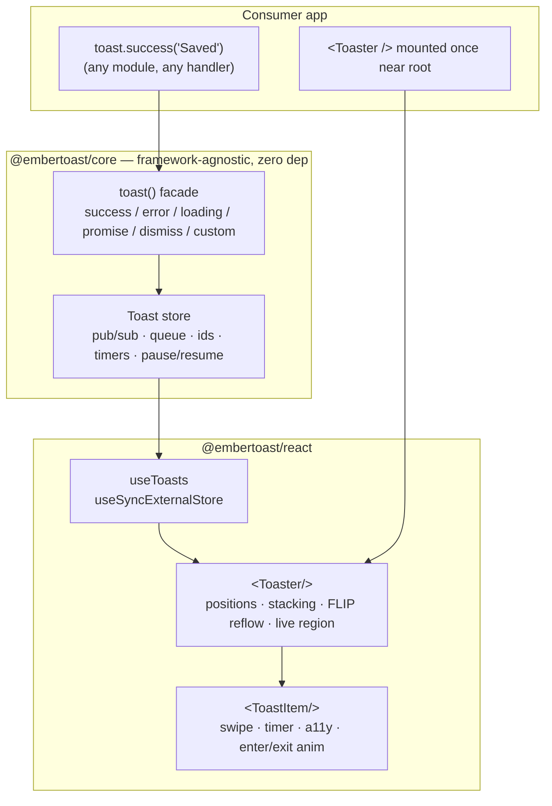
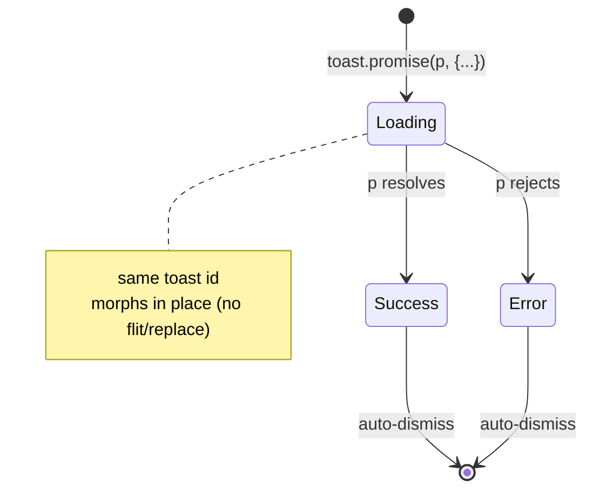

# Architecture

embertoast splits a notification system into two halves that most libraries fuse: a **producer** (`toast()`, an imperative function) and a **renderer** (`<Toaster/>`, a declarative component). They communicate only through a small framework-agnostic store. Everything below follows from that one decision.

## System context

## Why `toast()` is a store, not a hook

A hook can only run inside a React component during render. That forces every "show a toast" call to originate from a component and to thread context or a ref to reach the renderer. It also rules out firing a toast from a plain utility, an Axios interceptor, a websocket handler, or any non-React module.

embertoast inverts this. The store is a module-level singleton that exists independent of React. `toast()` is a closure over that store — calling it mutates state and notifies subscribers. `<Toaster/>` is *only* a subscriber: it reads the store via `useSyncExternalStore` and renders whatever is there. The producer never imports React; the renderer never owns state.

Consequences:

- **Call from anywhere.** `toast()` works outside render, outside components, outside React entirely.
- **One renderer, many producers.** Any number of modules can fire toasts; a single mounted `<Toaster/>` shows them.
- **Adapters are possible.** Because the store carries no React, a Vue/Svelte/vanilla renderer is a new subscriber, not a rewrite. (We ship React only — see ROADMAP cut lines.)
- **Concurrent-safe.** `useSyncExternalStore` is the React-blessed way to subscribe to an external store without tearing under concurrent rendering.

## Module breakdown

| Module | Package | Responsibility |
|---|---|---|
| `store.ts` | core | The pub/sub: id allocation, the visible/queued split at `maxVisible`, per-toast timers with elapsed tracking, pause/resume, two-phase dismiss. The only stateful thing. |
| `toast.ts` | core | The `toast()` facade and its methods. Thin — it translates a call into a `store.add/update/dismiss`. `promise()` is the one method with real logic (lifecycle orchestration). |
| `types.ts` | core | The public type surface. `ToastOptions`, `Toast`, `Position`, `ToastState`, `ToasterConfig`. |
| `use-toasts.ts` | react | `useSyncExternalStore(subscribe, getSnapshot, getServerSnapshot)`. The whole React↔store bridge in one hook. |
| `Toaster.tsx` | react | The single subscriber. Owns the positioned container, the `aria-live` region, config push, and FLIP reflow across the list. |
| `ToastItem.tsx` | react | One toast: its countdown, pointer-drag swipe, enter/exit phase animation, and accessible role. |
| `styles.css` | react | The styled default, entirely CSS custom properties. Opt-in; headless users skip it. |

## How a toast moves through the system

1. Code calls `toast.success("Saved", opts)`.
2. The facade calls `store.add(content, "success", opts)`. The store allocates an id, resolves options against config and per-type defaults, and decides visible-vs-queued against `maxVisible`. It emits a new immutable `ToastState`.
3. Every subscriber's listener fires. `useToasts` triggers a re-render of `<Toaster/>`.
4. `<Toaster/>` maps visible toasts to `<ToastItem/>`. A new item mounts in the `entering` phase; CSS plays the enter transition. The live region announces it (politeness by severity).
5. `<ToastItem/>` starts a timer for `duration`. Hover or window blur calls `store.pause(id)`, which captures `remaining`; leaving calls `store.resume(id)`, which restarts from the remainder.
6. On expiry, swipe past threshold, click, or `toast.dismiss(id)`, the store marks the toast `exiting` and emits. The item plays its exit transition and collapses its height; **FLIP** moves the survivors so they slide into the freed space instead of jumping. When the transition ends, the renderer calls `store.remove(id)` and a queued toast (if any) promotes into view.

## The promise lifecycle

`toast.promise` creates one toast in `loading` (pinned open, `duration: Infinity`), keeps its id, and awaits the promise. On settle it calls `store.update(id, …)` with the success/error type and the resolved content (resolvers may be functions of the result), then applies a normal auto-dismiss duration. The toast *morphs* — same DOM node, same id — so there's no flit or replace, which is what makes the transition feel intentional.

## The accessibility model

This is treated as a feature, not an afterthought. Most toast libraries are quietly inaccessible; doing it correctly is a differentiator.

- **One `aria-live` region per `<Toaster/>`.** Toasts are inserted into it so assistive tech announces them. The region is not the visual container — visual order and DOM/announcement order are managed independently.
- **Politeness by severity.** `error`/`warning` announce assertively (`role="alert"`, interrupts); everything else is polite (`role="status"`). A per-toast `ariaLive` overrides.
- **Focus is never stolen.** Mounting a toast does not move focus. Interactive toasts (with an action) are keyboard-reachable, but the toast does not trap focus or pull it from the user's current task.
- **`prefers-reduced-motion` is honored.** Under reduced motion, enter/exit/FLIP transitions collapse to instant; the stylesheet zeroes the durations and disables transforms. The library is fully usable with no animation.

## Performance model

- **Hot path = reflow.** When a toast leaves, the survivors must move at 60fps. FLIP keeps this on the compositor: measure First rects, let layout settle, measure Last, apply an inverting `transform`, then transition to identity. Only `transform`/`opacity` animate — no layout thrash per frame.
- **Allocation discipline.** Timers track elapsed time rather than recreating intervals; the store emits a new state object per change (so `useSyncExternalStore` can diff by reference) but reuses toast objects that didn't change.
- **Zero runtime deps + CSS, not CSS-in-JS.** No style runtime, no animation library. `sideEffects: false` on core and CSS-scoped side effects on react keep the bundle tree-shakeable; `size-limit` enforces the number in CI.

## Build & packaging

- **tsup (esbuild)** emits ESM + CJS + `.d.ts` for each package in one pass.
- **`@embertoast/core`** is `sideEffects: false` and dependency-free. **`@embertoast/react`** declares `react`/`react-dom` as peers, bundles the core, and ships its CSS as a separately-importable side-effect file.
- The two packages version together (changesets `fixed` group) and publish to npm with provenance.
- The **docs app** consumes the workspace packages from source (`transpilePackages`), dogfooding the unpublished build, and builds to a Next standalone output for a thin Docker image.
